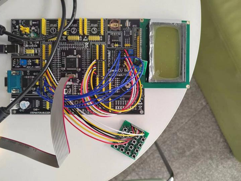

# 项目介绍

&emsp;&emsp;本项目是华中科技大学未来技术学院单片机与嵌入式系统课程提高实验，利用C8051F020开发套件实现了一个猜数游戏。包括C语言和汇编语言版本，详细注释，适合初学者学习参考。还公开了实验报告。    
B站介绍视频：[猜数游戏](https://www.bilibili.com/video/BV1Jg4y1k75C)
## 任务要求

1. 随机出一组数据，显示在LCD上或者LED数码管上一段时间后熄灭。
2. 玩家可以通过按键输入数据，比较是否输入正确。
3. 如果正确，提示是否继续？是否增加难度？（增加难度如显示时间变短、数据长度增加等）如果继续，重新开始。如果不继续就退出。
4. 如果错误，提示是否重新开始？参考3操作。
5. 也可以一开始就显示难度，并提供难度设置选项。

## 设计思路

**硬件选择**：C8051F020单片机+4*4键盘+LCD12864显示器

**实现功能**：用C语言和汇编语言实现了三种模式的猜数游戏——闯关模式、练习模式、随机模式。玩家通过按键输入数据和选择选项，通过LCD12864显示数据和提示。模块化、子程序化设计，便于调试、移植、修改。进行了输入验证和异常流程和边界条件测试，使软件稳定、可靠。提示完备，人机交互友好。使用反转法获得键盘输入键值，通过中文字库输出国标汉字，通过点阵图输出128*64像素的黑白图片。使用定时器T0来计时。

## 功能描述

实现了三种模式的猜数游戏——闯关模式、练习模式、随机模式和致谢功能。玩家通过4*4按键输入数据和选择选项，通过LCD12864显示数据和提示。

- **闯关模式**：共有10关，显示位数越来越大，难度越来越高。通过10关即赢得游戏，否则闯关失败。
- **练习模式**：玩家输入显示位数和显示时间来进行自定义练习。
- **随机模式**：显示数据位数与显示时间均随机。
- **致谢**：显示致谢信息。

## 特点（项目亮点）

1. 使用C语言和汇编语言多文件编程，模块化、子程序化设计，进行代码复用，便于调试、移植、修改。对源代码进行了详细的注释，便于阅读。
2. 代码99%以上原创，仅LCD12864显示的相关函数在网上资料上进行修改，核心技术要掌握在自己手上。
3. 进行了输入验证和异常流程和边界条件测试，使软件稳定、可靠。输入位数或者输入显示时间非法会做提示。
4. 提示完备，人机交互友好。使用菜单交互界面，用户友好设计，每一步都有完备的提示。输入数字时设计了按D键重输和按C键退格功能，以防不小心输错。设计了按E键返回和按F键确认功能。
5. 搭建了一个游戏机的框架，仅使用定时器T0，具有可拓展性，未来可添加更多游戏如数字炸弹、贪吃蛇、俄罗斯方块等，添加更多功能，如红外遥控功能、音乐功能、数字时钟功能等。

